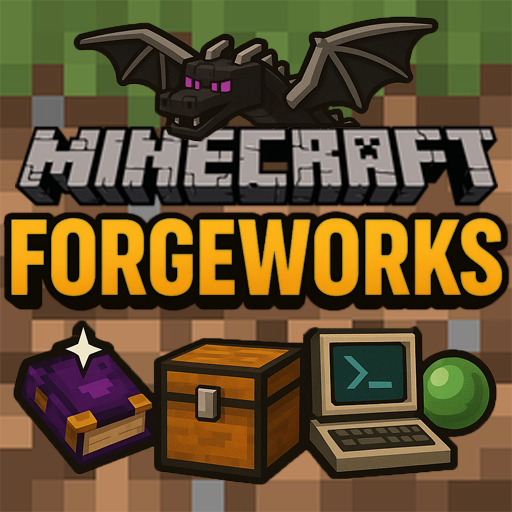

# Forgeworks

**Modpack containing magic, engineering and a few QOL mods.**

---

## About

This modpack is a magic/engineering modpack used on my Minecraft server with friends. It's focused on creating factories and using magic, but also contains lots of food items, and a few quality of life mods.

Other than that the modpack contains mods like [Sodium](https://www.curseforge.com/minecraft/mc-mods/sodium) to improve performance on the client-side as well as server-side.
